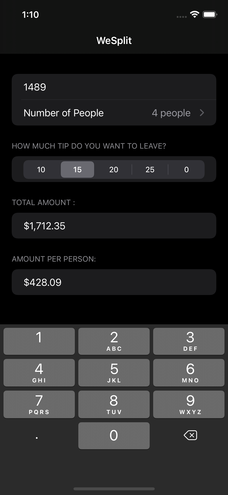
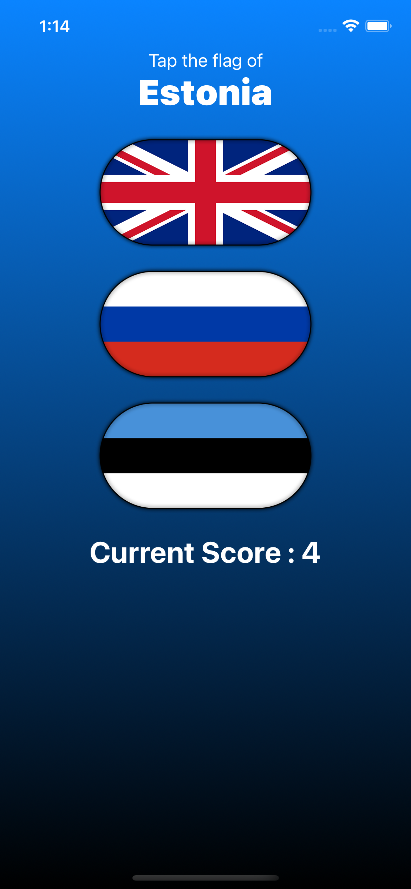
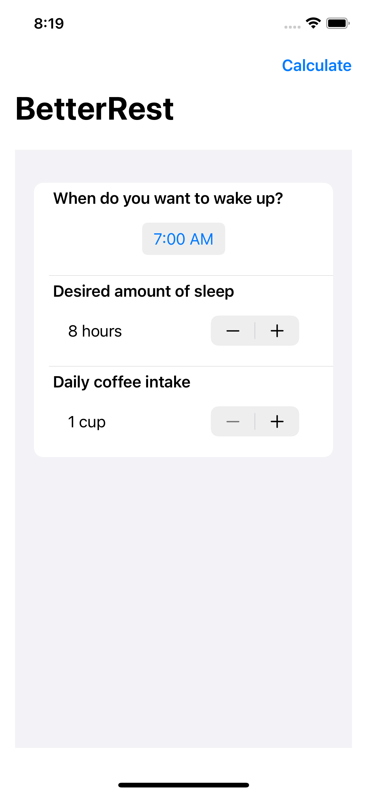
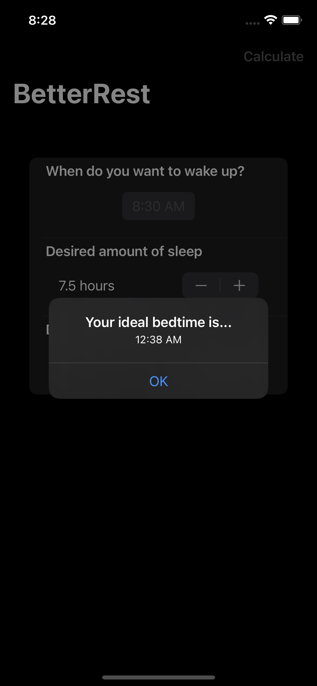

# SwiftUI-Projects
This repository consists of simple ios based apps that I built while following the course : https://www.hackingwithswift.com/100/swiftui

1. WeSplit: A check-splitting app that one might use after eating at a restaurant – Enter the cost of your food, select how much of a tip you want to leave, and how many people you’re with, and it will tell you how much each person needs to pay.

2. GuessTheFlag: A guessing game that helps users learn some of the many flags of the world. This project also uses the concept of alerts.

3. BetterRest:An app that helps coffee drinkers get a good night’s sleep by asking them three questions:
  1.When do they want to wake up?
  2.Roughly how many hours of sleep do they want?
  3.How many cups of coffee do they drink per day?
Once we have those three values, we’ll feed them into Core ML to get a result telling us when they ought to go to bed. 

  
  
  

